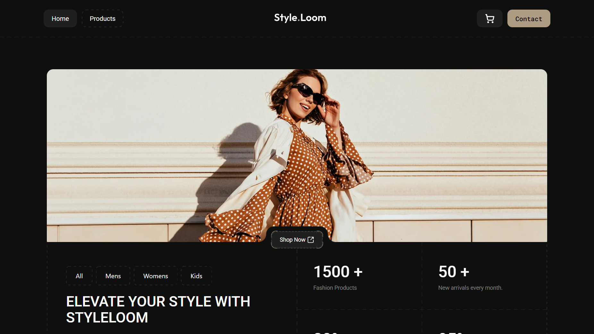
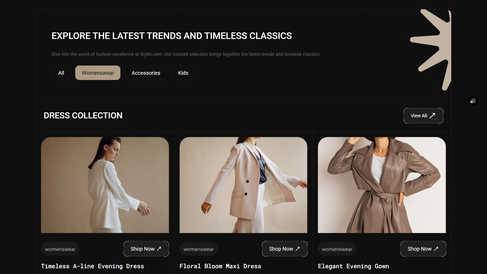
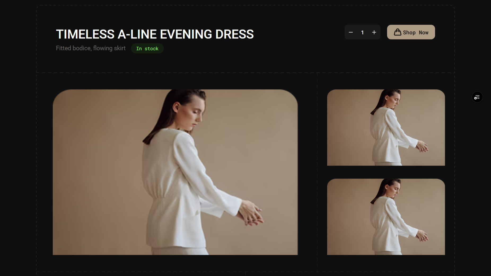
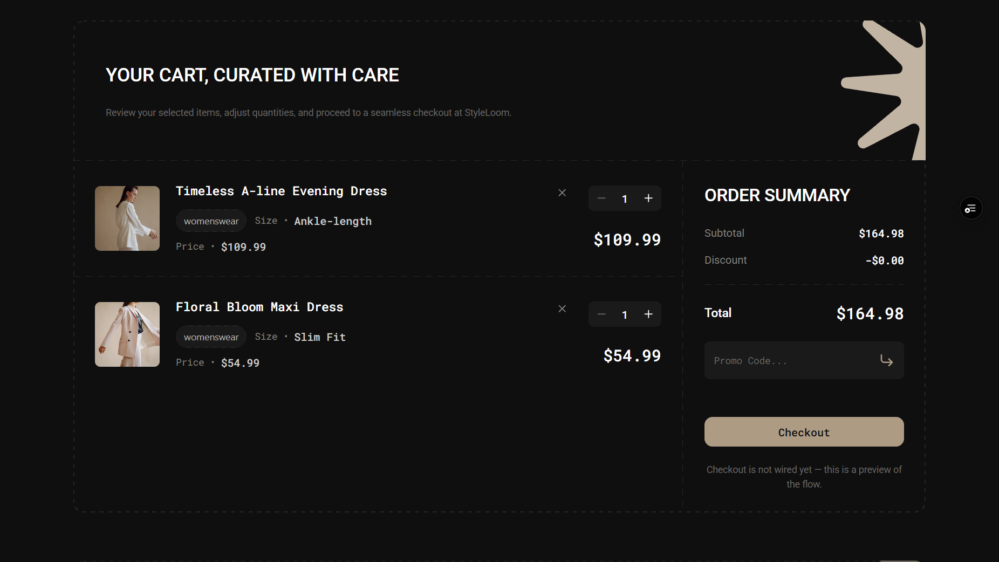
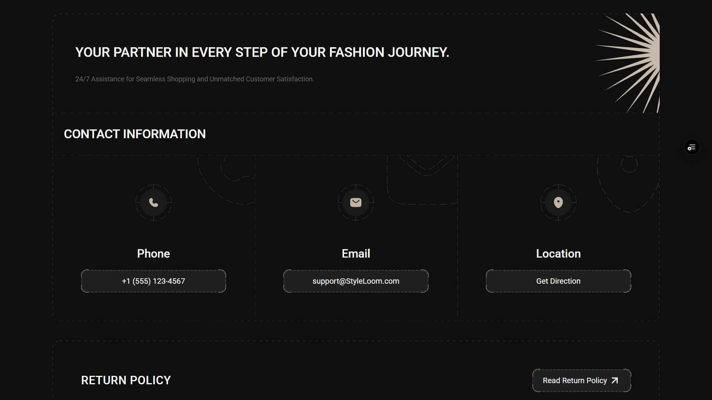

# StyleLoom

A responsive front-end e-commerce showcase (clothing store) with a real, persistent shopping cart — data is mocked, no backend required.

[](https://styleloom-ecommerce-three.vercel.app/) <!-- TODO: replace with the real Vercel URL -->
[](https://github.com/Mohammad-Allahyarii/styleLoom-eCommerce/actions/workflows/ci.yml)


> A Persian (فارسی) version of this README is available in the collapsible section at the bottom.

## Overview

StyleLoom is a front-end e-commerce project: a fashion storefront with product browsing, a working shopping cart, and a dark, dashed-border design system built with Tailwind CSS v4. All product, FAQ, and review data is mocked in the client — there is no backend — so the whole store runs entirely in the browser. It demonstrates typed state management (Zustand with localStorage persistence), client-side routing, form and input handling, and a responsive layout from mobile to desktop.

## Live demo

[https://YOUR-PROJECT.vercel.app](https://styleloom-ecommerce-three.vercel.app/) <!-- TODO: replace with the real Vercel URL -->

## Screenshots

| #   | Screenshot                                                  | Page                                               |
| --- | ----------------------------------------------------------- | -------------------------------------------------- |
| 1   |                      | `/` — hero, highlights, product sections           |
| 2   |              | `/products` — catalog with category filter         |
| 3   |  | `/products/1` — gallery, sizes, add to cart        |
| 4   |             | `/shopping-cart` — cart lines, promo code, summary |
| 5   |                | `/contact-us` — contact cards and policies         |
| 6   |        | `/` at mobile width                                |

## Features

### Shopping cart (functional)

- Add to cart, quantity stepper, and line removal; quantity is clamped to the 1–99 range
- Cart lines are keyed by product + size, so the same product in two sizes is two lines
- Promo codes: `SAVE10` applies a 10% discount; invalid codes, empty codes, and an empty cart are rejected
- Cart contents and the applied promo code persist across reloads via `localStorage`
- Invalid or stale persisted state (wrong types, unknown promo codes) is discarded on restore
- Order summary with subtotal, discount, and total derived by pure functions
- Empty-cart state with a link back to the products page

### Product browsing (partially functional)

- Home page with hero, stats, featured products, user reviews, and FAQ sections
- Products page with category filter buttons (`all`, `womenswear`, `accessories`, `kids`)
- Product detail page at `/products/:productID` with gallery, materials, features, sizes, and ratings
- Add to cart and quantity control from the product detail page
- Category filtering is functional; the "Dress Collection / Accessories / Bags" groups on the products page are static slices of the same mock list (UI only)
- Size selector on the product detail page is display-only (UI only)

### UI & design

- Dark theme with a dashed-border design system (buttons, boxes, dividers)
- Responsive from mobile to desktop (Tailwind CSS v4, mobile-first utilities)
- Scroll-triggered section animations (`motion`) and a marquee footer ticker
- Unknown URLs render a styled 404 page inside the normal layout; unknown product ids render a "Product not found" view
- Scroll-to-top on route change

## Tech stack

| Technology     | Version  | Purpose                                            |
| -------------- | -------- | -------------------------------------------------- |
| React          | ^19.2.7  | UI library                                         |
| TypeScript     | ~6.0.2   | Type-safe code                                     |
| Vite           | ^8.1.0   | Dev server and production build                    |
| Tailwind CSS   | ^4.3.1   | Styling (CSS-first theme tokens)                   |
| react-router   | ^7.18.0  | Client-side routing (`createBrowserRouter`)        |
| Zustand        | ^5.0.14  | Cart state with `persist` + `devtools` middleware  |
| motion         | ^12.42.2 | Section reveal animations, ticker, button feedback |
| lucide-react   | ^1.23.0  | Icons                                              |
| clsx           | ^2.1.1   | Conditional class names                            |
| ESLint         | ^10.5.0  | Linting (react-hooks, react-refresh plugins)       |
| Prettier       | ^3.9.1   | Formatting + import sorting plugin                 |
| GitHub Actions | —        | CI: format check, lint, build                      |

## Getting started

Prerequisites: Node.js 22 (the CI uses Node 22; there is no `engines` field or `.nvmrc` in the repo), npm 10+.

```bash
git clone https://github.com/Mohammad-Allahyarii/styleLoom-eCommerce.git
cd styleLoom-eCommerce
npm install
npm run dev
```

The dev server starts on `http://localhost:5173` (bound to `--host` for network access).

Production build and local preview:

```bash
npm run build
npm run preview
```

## Available scripts

| Script            | What it does                                   |
| ----------------- | ---------------------------------------------- |
| `npm run dev`     | Start the Vite dev server with `--host`        |
| `npm run build`   | Type-check with `tsc -b`, then build with Vite |
| `npm run lint`    | Run ESLint over the repo                       |
| `npm run preview` | Serve the production build locally             |
| `npm run format`  | Format the whole repo with Prettier            |

## Project structure

```text
src/
├── Layouts/MainAppLayou/   # App shell: navbar, footer, layout route
├── Pages/                  # One folder per route (home, products, cart, ...)
├── components/             # Shared UI (Button, ProductCard, ticker, ...)
├── constants/              # Mock data and design constants
├── hooks/                  # Reusable hooks (useMediaQuery)
├── stores/                 # Zustand cart store + pure cart math
├── types/                  # Shared TypeScript types (cart)
├── utils/                  # Helpers (product lookup, random items)
└── assets/                 # Fonts, icons, images, logos
```

## Deployment

The app deploys on Vercel as a static Vite build: framework preset Vite, build command `npm run build`, output directory `dist`. `vercel.json` contains a single SPA rewrite (`/(.*) → /index.html`) so client-side routes such as `/products/1` and `/shopping-cart` resolve on refresh and direct visits instead of returning a 404. No environment variables are required.

## Known limitations

- No backend: all products, FAQs, reviews, and contact details are mock data in `src/constants/constants.ts`; there are no API calls.
- No checkout or payment: the Checkout button is a UI placeholder; the order summary is computed client-side only.
- No authentication, no user accounts, no order history.
- No automated tests: CI runs the format check, ESLint, and the type-checked build, but there is no test runner.
- No i18n: the UI is English-only.
- The cart stores product image URLs; a future re-build that changes asset hashes or paths would break images in already-persisted carts.
- Product detail extras (sizes, ratings breakdown, features, gallery images) are hardcoded fallbacks, not driven by the product data.
- The promo system is hardcoded to `SAVE10` (10% off); only one code can be active.
- Product data has no per-size pricing or stock; sizes are display-only.
- No route-level code splitting: the app ships as a single JS chunk (~500 kB before gzip).

## Roadmap

- Planned: route-level code splitting with `React.lazy` to shrink the initial bundle.
- Planned: introduce an automated test runner (Vitest + Testing Library) for cart math and store logic.
- Planned: move mock data behind typed async data-access functions so a real API can replace it later.
- Planned: make product sizes interactive and cart lines size-aware in the UI.
- Planned: wire checkout to a real payment provider (Stripe or similar) behind a backend service.
- Planned: replace the persisted image URLs with stable public paths or product ids.
- Planned: add a license and fill in the placeholder demo URL.
- Planned: add `engines`/`.nvmrc` to pin the Node version.

## Author

**Mohammad Allahyari** — [@Mohammad-Allahyarii](https://github.com/Mohammad-Allahyarii)

<details>
<summary><b>فارسی (Persian)</b></summary>

<div dir="rtl">

# استایل‌لوم (StyleLoom)

یک پروژه‌ی فرانت‌اند فروشگاهی (نمایشی) با سبد خرید واقعی و ماندگار — داده‌ها Mock هستند و نیازی به بک‌اند نیست.

> نسخه‌ی انگلیسی این فایل در بالای همین سند آمده است.

## نمای کلی

استایل‌لوم یک پروژه‌ی فرانت‌اند تجارت الکترونیک است: ویترینی از پوشاک با مرور محصولات، سبد خریدِ کارا و یک سیستم طراحی تیره با حاشیه‌های خط‌چین که با Tailwind CSS v4 ساخته شده. تمام داده‌های محصولات، سوالات متداول و نظرات به‌صورت Mock در سمت کلاینت نگهداری می‌شوند — بک‌اندی وجود ندارد — بنابراین کل فروشگاه کاملاً در مرورگر اجرا می‌شود. این پروژه مهارت‌هایی مانند مدیریت state تایپ‌شده (Zustand با ذخیره‌سازی در localStorage)، مسیریابی سمت کلاینت، مدیریت فرم و ورودی‌ها، و چیدمان واکنش‌گرا از موبایل تا دسکتاپ را نشان می‌دهد.

## دموی زنده

[https://YOUR-PROJECT.vercel.app](https://YOUR-PROJECT.vercel.app) <!-- TODO: replace with the real Vercel URL -->

## اسکرین‌شات‌ها

تصاویر در پوشه‌ی `docs/screenshots/` قرار می‌گیرند (هنوز ثبت نشده‌اند) و در بخش انگلیسیِ بالای همین سند نمایش داده شده‌اند: صفحه‌ی اصلی (`home.png`)، محصولات (`products.png`)، جزئیات محصول (`product-detail.png`)، سبد خرید (`cart.png`)، تماس با ما (`contact.png`) و نمای موبایل (`mobile-home.png`).

## امکانات

### سبد خرید (کارا)

- افزودن به سبد، استپر تغییر تعداد و حذف قلم؛ تعداد در بازه‌ی ۱ تا ۹۹ محدود می‌شود
- خط‌های سبد با کلید «محصول + سایز» ساخته می‌شوند؛ یک محصول در دو سایز = دو خط جداگانه
- کد تخفیف: `SAVE10` ده درصد تخفیف اعمال می‌کند؛ کد نامعتبر، کد خالی و سبد خالی رد می‌شوند
- محتوای سبد و کد تخفیف فعال با `localStorage` در بارگذاری‌های بعدی باقی می‌مانند
- داده‌ی ذخیره‌شده‌ی نامعتبر (تایپ اشتباه یا کد ناشناخته) هنگام بازیابی دور ریخته می‌شود
- خلاصه‌ی سفارش با جمع جزء، تخفیف و مبلغ نهایی که با توابع خالص محاسبه می‌شوند
- حالت سبد خالی با لینک بازگشت به صفحه‌ی محصولات

### مرور محصولات (تاحدی کارا)

- صفحه‌ی اصلی شامل هیرو، آمار، محصولات ویژه، نظرات کاربران و بخش سوالات متداول
- صفحه‌ی محصولات با دکمه‌های فیلتر دسته‌بندی (`all`، `womenswear`، `accessories`، `kids`)
- صفحه‌ی جزئیات محصول در `/products/:productID` با گالری، جنس، ویژگی‌ها، سایزها و امتیازها
- افزودن به سبد و کنترل تعداد از صفحه‌ی جزئیات محصول
- فیلتر دسته‌بندی کار می‌کند؛ گروه‌های «Dress Collection / Accessories / Bags» در صفحه‌ی محصولات برش‌های ثابتی از همان لیست Mock هستند (فقط رابط کاربری)
- انتخاب سایز در صفحه‌ی جزئیات محصول صرفاً نمایشی است (فقط رابط کاربری)

### رابط کاربری و طراحی

- تم تیره با سیستم طراحیِ حاشیه‌ی خط‌چین (دکمه‌ها، باکس‌ها، جداکننده‌ها)
- واکنش‌گرا از موبایل تا دسکتاپ (Tailwind CSS v4 با رویکرد موبایل‌محور)
- انیمیشن بخش‌ها هنگام اسکرول (`motion`) و نوار متحرک (ticker) در فوتر
- آدرس‌های ناموجود، صفحه‌ی 404 استایل‌دار داخل چیدمان معمول را می‌بینند؛ شناسه‌ی محصول ناشناخته هم نمای «محصول یافت نشد» را نشان می‌دهد
- اسکرول به بالای صفحه هنگام تغییر مسیر

## پشته‌ی فناوری

| فناوری         | نسخه     | کاربرد                                              |
| -------------- | -------- | --------------------------------------------------- |
| React          | ^19.2.7  | کتابخانه‌ی رابط کاربری                              |
| TypeScript     | ~6.0.2   | کد تایپ‌محور                                        |
| Vite           | ^8.1.0   | سرور توسعه و بیلد production                        |
| Tailwind CSS   | ^4.3.1   | استایل‌دهی (توکن‌های تم به‌صورت CSS)                |
| react-router   | ^7.18.0  | مسیریابی سمت کلاینت (`createBrowserRouter`)         |
| Zustand        | ^5.0.14  | state سبد خرید با میان‌افزار `persist` و `devtools` |
| motion         | ^12.42.2 | انیمیشن ظاهرشدن بخش‌ها، ticker و بازخورد دکمه‌ها    |
| lucide-react   | ^1.23.0  | آیکون‌ها                                            |
| clsx           | ^2.1.1   | ترکیب شرطی کلاس‌ها                                  |
| ESLint         | ^10.5.0  | لینت (پلاگین‌های react-hooks و react-refresh)       |
| Prettier       | ^3.9.1   | قالب‌بندی + پلاگین مرتب‌سازی importها               |
| GitHub Actions | —        | CI: بررسی فرمت، لینت و بیلد                         |

## شروع به کار

پیش‌نیازها: Node.js نسخه‌ی ۲۲ (CI از Node 22 استفاده می‌کند؛ فیلد `engines` و فایل `.nvmrc` در مخزن وجود ندارد) و npm نسخه‌ی ۱۰ یا بالاتر.

```bash
git clone https://github.com/Mohammad-Allahyarii/styleLoom-eCommerce.git
cd styleLoom-eCommerce
npm install
npm run dev
```

سرور توسعه روی `http://localhost:5173` اجرا می‌شود (با `--host` برای دسترسی شبکه).

بیلد production و پیش‌نمایش محلی:

```bash
npm run build
npm run preview
```

## اسکریپت‌های موجود

| اسکریپت           | کاری که می‌کند                              |
| ----------------- | ------------------------------------------- |
| `npm run dev`     | اجرای سرور توسعه‌ی Vite با `--host`         |
| `npm run build`   | ابتدا تایپ‌چک با `tsc -b`، سپس بیلد با Vite |
| `npm run lint`    | اجرای ESLint روی کل مخزن                    |
| `npm run preview` | سروکردن بیلد production به‌صورت محلی        |
| `npm run format`  | قالب‌بندی کل مخزن با Prettier               |

## ساختار پروژه

```text
src/
├── Layouts/MainAppLayou/   # پوسته‌ی برنامه: نوار بالا، فوتر، مسیر چیدمان
├── Pages/                  # یک پوشه برای هر مسیر (خانه، محصولات، سبد خرید، ...)
├── components/             # اجزای مشترک رابط کاربری (Button، ProductCard، ticker، ...)
├── constants/              # داده‌های Mock و ثابت‌های طراحی
├── hooks/                  # هوک‌های قابل استفاده‌ی مجدد (useMediaQuery)
├── stores/                 # فروشگاه Zustand سبد خرید + محاسبات خالص
├── types/                  # تایپ‌های مشترک TypeScript (سبد خرید)
├── utils/                  # توابع کمکی (جست‌وجوی محصول، آیتم‌های تصادفی)
└── assets/                 # فونت‌ها، آیکون‌ها، تصاویر، لوگوها
```

## استقرار

این برنامه روی Vercel به‌صورت یک بیلد استاتیک Vite مستقر می‌شود: پریست Vite، دستور بیلد `npm run build` و پوشه‌ی خروجی `dist`. فایل `vercel.json` یک بازنویسی SPA دارد (`/(.*) → /index.html`) تا مسیرهای سمت کلاینت مانند `/products/1` و `/shopping-cart` در رفرش و ورود مستقیم به‌جای خطای 404 درست باز شوند. هیچ متغیر محیطی لازم نیست.

## محدودیت‌های فعلی

- بدون بک‌اند: همه‌ی محصولات، سوالات متداول، نظرات و اطلاعات تماس، داده‌ی Mock در `src/constants/constants.ts` هستند؛ هیچ فراخوانی API وجود ندارد.
- بدون پرداخت: دکمه‌ی Checkout فقط یک جای‌نگهدار رابط کاربری است؛ خلاصه‌ی سفارش فقط سمت کلاینت محاسبه می‌شود.
- بدون احراز هویت، حساب کاربری و تاریخچه‌ی سفارش.
- بدون تست خودکار: CI بررسی فرمت، ESLint و بیلد تایپ‌محور را اجرا می‌کند اما test runner‌ای وجود ندارد.
- بدون i18n: رابط کاربری فقط انگلیسی است.
- سبد خرید آدرس تصویر محصولات را ذخیره می‌کند؛ اگر بیلد آینده هش یا مسیر assetها را تغییر دهد، تصاویرِ سبد‌های ذخیره‌شده می‌شکنند.
- بخش‌های تکمیلی صفحه‌ی محصول (سایزها، تفکیک امتیازها، ویژگی‌ها، تصاویر گالری) مقادیر ثابت هستند و از داده‌ی محصول نمی‌آیند.
- سیستم تخفیف به `SAVE10` (۱۰ درصد) محدود است؛ فقط یک کد می‌تواند فعال باشد.
- داده‌ی محصول قیمت و موجودیِ به‌ازای سایز ندارد؛ سایزها فقط نمایشی‌اند.
- بدون code splitting در سطح مسیر: برنامه به‌صورت یک chunk واحد ارسال می‌شود (حدود ۵۰۰ کیلوبایت پیش از gzip).

## نقشه‌ی راه

- برنامه‌ریزی‌شده: code splitting در سطح مسیر با `React.lazy` برای کوچک‌شدن باندل اولیه.
- برنامه‌ریزی‌شده: افزودن test runner خودکار (Vitest و Testing Library) برای محاسبات و منطق سبد.
- برنامه‌ریزی‌شده: انتقال داده‌های Mock پشت توابع async تایپ‌دار تا بعداً یک API واقعی جایگزین شود.
- برنامه‌ریزی‌شده: تعاملی‌کردن انتخاب سایز و آگاه‌کردن خط‌های سبد از سایز در رابط کاربری.
- برنامه‌ریزی‌شده: اتصال Checkout به یک درگاه پرداخت واقعی (مانند Stripe) پشت یک سرویس بک‌اند.
- برنامه‌ریزی‌شده: جایگزینی آدرس‌های تصویرِ ذخیره‌شده با مسیرهای عمومی پایدار یا شناسه‌ی محصول.
- برنامه‌ریزی‌شده: افزودن مجوز (LICENSE) و جایگزینی آدرس دموی جای‌نگهدار.
- برنامه‌ریزی‌شده: افزودن `engines`/`.nvmrc` برای تثبیت نسخه‌ی Node.

## نویسنده

**محمداللهیاری (Mohammad Allahyari)** — [@Mohammad-Allahyarii](https://github.com/Mohammad-Allahyarii)

</div>

</details>
